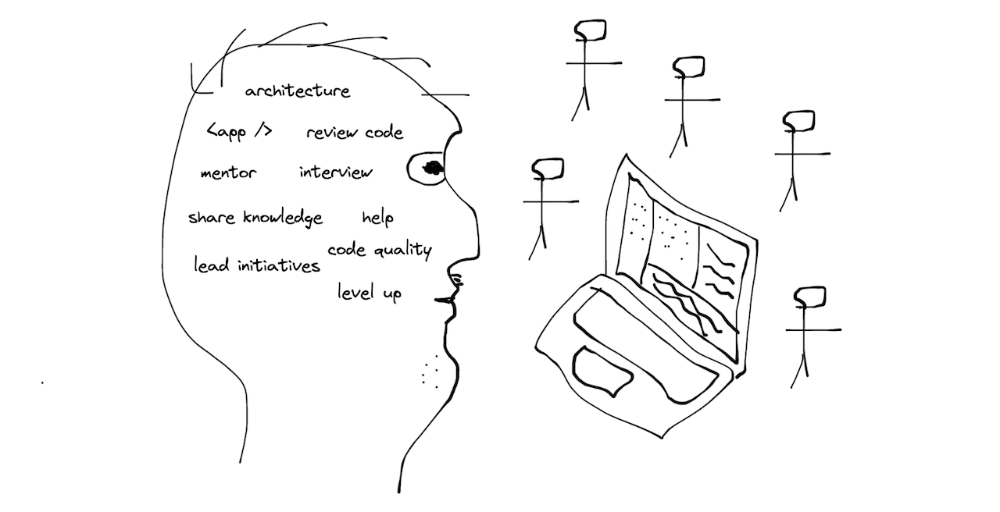

A year has passed since I joined [Flink](https://www.goflink.com/) as a Staff Frontend Engineer.  
Now is time to look back and reflect.  
  
## Intro

When I was joining [Flink](https://www.goflink.com/), a grocery delivery startup with a [multi-billion](https://techcrunch.com/2021/12/09/flink-the-berlin-based-instant-grocery-startup-is-now-valued-at-2-85b-after-raising-750m-in-a-round-led-by-doordash/) dollar valuation, I had no idea what the role is about. I bought a [book](https://staffeng.com/book) that offered some insights about the responsibilities of Staff engineers, but the scope seemed too vague, I wasn't sure what I should actually be doing in practice and whether that position was right for me.  
  
The change was intimidating and intriguing at the same time.
  
Now, having worked for a year at that position, I can certainly say that it was one of the best decisions I ever made, and it was probably the most fruitful year of my career.  
  
Over the course of the year, I constantly dragged myself into new areas of work, and I learned and achieved a lot. I built confidence in areas of work that I previously thought were not for me and not in my comfort zone. I discovered that I enjoy and am very good at a lot of other things besides coding. My appetite increased significantly as I made progress.

## Learnings

### Build relationships and earn credibility

Right from the beginning, I focused on developing trusting relationships with my colleagues, especially with the frontend engineers.  
  
I believed I had to first demonstrate my competence, my ability to write quality code, my ability to provide thoughtful PR reviews, my ability to help find bugs and fix them, and my being a person others can rely upon.

Regular one-on-ones with developers also helped a lot in building relationships. It gave me the opportunity to learn about their struggles, their perspectives on things, and get their feedback on how I performed and how I could help them.

That helped me a lot going forward in implementing my initiatives and getting buy-in from developers.
  
### Don't be a bottleneck

With a good, strong reputation, it's easy to become a bottleneck when people start approaching you directly looking for help. That way, other developers miss an opportunity to help and learn, and you end up spending more time answering questions of all kinds.

Knowledge sharing is important, and whenever someone needs help, other colleagues should have the chance to provide help and learn from one another's mistakes.

I created a dedicated Slack channel for frontend engineers, actively promoted it, and redirected questions there.
  
### Knowledge sharing and building a community

Often, organizational structure doesn't facilitate cross-team or cross-department collaboration. Developers work on their projects in isolation, which negatively affects their company because the same solutions are constantly being re-implemented and the same issues occur across different projects. Lack of collaboration also means fewer opportunities to learn and grow, which leads to dissatisfaction and a poor retention rate.

I had been there myself, and I believed that it's very important to build a strong frontend community where developers could be passionate about their work, share knowledge, support one another, and collaborate on shared libraries and projects.

I organized regular frontend meetups and encouraged developers to present their topics there - to share what issues they have fixed and things they are excited about. I myself regularly shared important information about the company's web landscape, hosting solutions, caching issues, etc.

I was also looking for opportunities to standardize infrastructure in use and create libraries and tools used by all projects across the company. Besides the obvious benefits of infrastructure reuse and code deduplication, this would give developers common ground to work on, provide an opportunity to create an impact on the whole organization, and create a space for collaboration with other developers. Additionally, switching between projects and onboarding new developers would be simplified.

Going together to a conference was another thing I was pushing for. You learn new things, get inspired, and become friends with your colleagues. That, in my opinion, is the best use of the development budget. We attended the React Day Berlin and VueJS Amsterdam conferences.

### Focus on impact and your expertize

When you are new to the company, it can be challenging to understand where to start and what to work on. Even company veterans might face the same difficulty.

It happened to me as well. I once joined some backend-focused initiative purely out of interest because I did not see interesting and impactful enough areas in frontend engineering. It was a trap, and I am glad that I escaped it.

What helped me during such moments of doubt was reminding myself that I am a very knowledgeable and experienced frontend engineer and that it would be a shame for the company not to make use of it. There must be something in my area of expertise and interests for me. With that in mind, I explored what was happening in other domains (departments) and what struggles and issues they had. The result of it was me moving to a department in need. I also challenged the status quo in my former department and came up with organizational changes - formation of a web platform team and the transfer of certain projects under its ownership.

### Your manager is your advocate

The work you do as a Staff Engineer might not be directly visible to the rest of the company. There can be no direct relationship between your work and the company's performance.

For example, how can you quantify the impact you are making by building a frontend community, setting up a proper interview process, and hiring best-in-class developers?

It can also be challenging for your manager to properly assess your work if they are in charge of a specific domain and your work far exceeds the scope of that domain. They won't be a good advocate for you, and it can hinder your growth and career.

The lesson I learned here is to be conscious of who my manager is and make sure they are interested in the work I do and that my work is transparent to them.

## What I like about my work

### Freedom

The position gives me freedom - I am in charge of deciding what to work on. I am no longer required to perform tedious tasks, like building ui forms. Instead, I focus on challenging, impactful, and full of learnings tasks that let me fully utilize my knowledge and experience.

Nobody expects me to write code myself and deliver something every day. That gives me time and peace of mind for deep thinking and evaluation of different ideas, to be creative, to work more with people, and to invest my time in them.

A dream job, isn't it?

### Power

I am a member of my domain leadership group and my voice is respected. I can influence teams' roadmaps, I can influence the trajectory of web development at the domain level and even at the company level, and I can come up with initiatives for teams to work on.

Freedom and Power combined make me extremely happy and enable me to be as impactful as I can.

## Things I wish I had more time for

### Writing code

All pre-Staff positions add value to a company primarily by writing code and implementing features themselves. Staff Engineer position bestow Freedom and Power on you to bring far more value. How? By implementing things that scale, i.e., enabling engineers to do their job, helping them, couching them, redirecting their focus to more important tasks, coming up with architectural changes, and bringing highly skilled developers aboard.

As a result, I write less code myself, which is something I wish I could do more of. Although I should be an expert in my field, I don't have as much time for practice now. Finding the right balance is important.

## Conclusion

Changing my position from Senior to Staff Frontend engineer was a tremendous shift for me.

It has been a very fruitful, exciting, and full of learnings experience.

I was able to apply my knowledge and experience on a large scale, and my skill set expanded.
