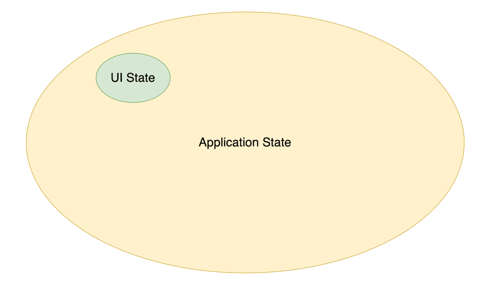
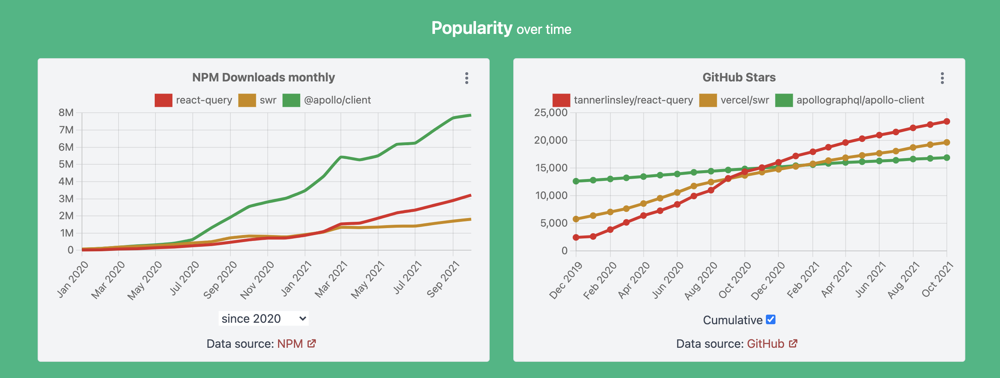
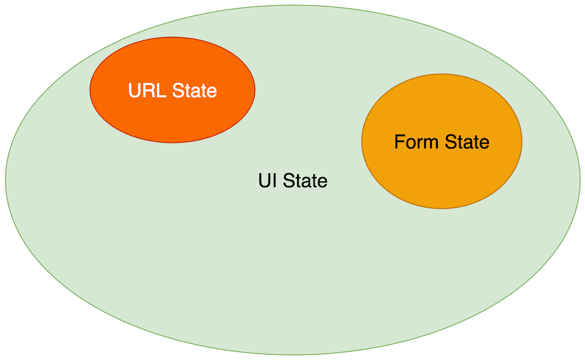

State Management in Frontend is complicated and approaches are not yet settled. New state management libraries keep popping up. In search for a silver bullet, libraries and frameworks authors come up with different brilliant APIs and approaches. Developer Community has produced guidelines for many scenarios.

Nevertheless, developers continue to struggle. Why is that? What do we miss?

## The Complexities of State Management

UI is a function of state. We make a minor modification to application state `setLoading(true)` and the entire UI changes to show the loading indicator.

Doing State Management right is a key ingredient in achieving great UX.

However, it is not a trivial task to do. We need to care about a lot of things:

- define the Store structure and what to put in the Store
- how and when to initialize and update the Store
- immutable vs mutable
- local vs global
- how to handle dependent state data
- how to represent all possible states of API requests
- how to mock Store in tests
- etc.

As a result, we usually get

- a lot of imperative and boilerplate code
- components tightly coupled with the Store
- components logic that is scattered over multiple files
- complicated tests
- complicated refactoring
- decreased developer productivity

## Separation Of Concerns

Developers have created a plethora of libraries, techniques, and guideline to overcome or at least mitigate the challenges. And for many, it introduces a new issue: how to navigate between different libraries and techniques? When to use which?

I recognize an abstraction (perspective) that can be especially valuable when dealing with the subject. This perspective is often missing in discussions about State Management. I am talking about **Separation of Concerns**.

In UI we deal with huge amount of data with different characteristics and of different nature. We often treat all the data the same way and use the same approaches and libraries.

If we apply the principle of Separating Concerns to state handling, then we discover, that

- not all data are equal
- some data are simple and trivial to handle
- some data are more complex, nuanced and tricky to handle
- there are often specialised libraries which help dealing with the complex data

Having realised that, we can start segregating data and look for specialised tools to manage complex and nuanced data. Those tools usually automate a lot of things we used to do manually and bring relief.

I find helpful recognizing the following categories of data:

- Server State
- Form State
- UI State (excl. Form State)

## UI State vs Server State

The first and foremost data separation should be made between UI State and Server State data because their characteristics differ greatly.

**UI State** includes all the data that is not persistent and is not stored on Server.

It is stored **locally in Browser** and is normally reset on page reload.

The data is **synchronous** (mostly). Changes to data are “immediate” and there is no intermediate state, we don’t need to wait for new data to come. Whenever the state change happens, we always know the new state.

Most UI State changes are triggered by user actions - “click”, “hover”, “scroll”, etc.

Examples of UI State:

- dark/light mode
- filters state
- forms validation state

**Server State** data is stored permanently on Server. UI needs to fetch data from Server and send changes back to Server.

Server State is **Asynchronous**. UI needs to fetch it and that takes time. We don’t know upfront how long it takes and what the value will be. We don’t even know if the request will be successful. The same applies when we need to update the state and persist it on Server.

Another major characteristic of Server Data State - it is **remote** and it is not under our control. It has **shared ownership**. Anyone and anything can change data on the Server without our knowledge. It means, that we don’t know for sure if the fetched data is up to date.

## Solutions for UI State

Most of existing state management libraries (e.g. [Redux](https://redux.js.org/), [MobX](https://mobx.js.org/), [Zustand](https://zustand.surge.sh/)) and approaches are tailored to handle synchronous UI State data:

- define and initialize the Store
- update data in the Store
- subscribe to changes in the Store
- notify all the subscribed components about the State changes.

Developers just need to choose a proper one.

In my experience, the share of UI state and the code needed to manage it is very small for most applications.

That makes the problem of choosing a UI state management library insignificant. If we use those libraries to handle true UI State data only, then most of them work just fine and the switch between any of them does not make a big difference.

## Solutions for Server State

The characteristics of Server State defined [above](./#ui-state-vs-server-state) make the handling of it especially difficult and tricky. And that is where common state management libraries don’t help much.

Some of the challenges that developers face when working with Server State:

- know if data have already been fetched and is available
- know if fetching is currently in progress
- know if fetching has failed
- deduplicate requests
- re-fetch on error
- cache data and invalidate the cache
- handle mutations with dependent data (think of when changing one entity affects other entities)
- optimistic updates
- reflect Server State in UI

We all know the cost of attempting to solve these challenges on our own using common state management libraries.

Fortunately, we are seeing a rise of libraries that specialize in managing Server State and solving all the inherent challenges.

https://moiva.io/?npm=@apollo/client+react-query+relay-runtime+swr.

These libraries automate the majority of the tasks, drastically reduce the amount of boilerplate code, and provide declarative APIs with thoughtful defaults.

Some of [**GraphQL Clients**](https://moiva.io/?npm=@apollo/client+relay-runtime) were the first who pioneered the approach. They are designed specifically for GraphQL APIs. Example: [Apollo Client](https://www.apollographql.com/docs/react/), [Relay](https://relay.dev/).

Next came libraries to help manage Server State with REST APIs:

- [React Query](https://react-query.tanstack.com/)
- [SWR](https://swr.vercel.app/)
- [RTK Query](https://redux-toolkit.js.org/rtk-query/overview)

At this moment, React Query is probably the most sophisticated and [popular](https://moiva.io/?npm=react-query) library to handle RESTful Server State.

React Query is React specific, but its core was fully [separated](https://react-query.tanstack.com/guides/migrating-to-react-query-3#core-separation) from React and it can be used to build solutions for other frameworks as well. Such solutions have already begun to emerge. For example, [Vue Query](https://github.com/DamianOsipiuk/vue-query/).

## Form State

It is often helpful to separate Form State handling from the rest of the UI state.

Reason - Form handling is tricky and nuanced. You need:

- maintain state of a form as a whole: `isDirty`, `isValid`, `isSubmitting`, `dirtyFields`, etc.
- maintain state of each particular field: `isDirty`, `isValid`, `errors`, `isDisabled`, `currentValue`, `initialValue`
- reset form’s and fields’ state
- trigger validation
- etc.

For simple forms and simple use cases we can manage the state ourselves. But for complex cases it is better to reach out for specialised tools.

Examples of form handling libraries:

- [React Hook Form](https://react-hook-form.com/)
- [Formik](https://formik.org/)

Some JavaScript frameworks have built-in tools to manage forms state.

## Navigation (URL) State

Navigation (URL) State is another part of UI State which is helpful to distinguish.

URL path, query parameters, and hash all determine what is displayed and how it is displayed on the page.

The decision about which parts of UI state to include and which not to include in the URL is usually based on the answers to a couple of basic questions:

> What state should be shareable through links?

> What state should be preserved when the page is reloaded?

Although one can use [History](https://developer.mozilla.org/en-US/docs/Web/API/History)'s `pushState()` and `replaceState()` methods to manage URL State, it is often better to use dedicated routing libraries which provide useful abstractions and helper functions and are usually framework specific.

Examples of routing libraries:

- [React Router](https://reactrouter.com/)
- [React Location](https://react-location.tanstack.com/)
- [Vue Router](https://router.vuejs.org/)

Developers sometimes put URL state in Global Store and manage it using Redux or other standard state management libraries. I see it as an antipattern:

- it adds additional complexity because you need to synchronize Global state and URL state
- you have two sources of truth, which might lead to confusion about when to use which

That additional complexity and confusion can be a source of bugs.

## Conclusion

Application of the Separation of Concerns principle to State Management subject may finally make it manageable and simpler to reason about.

Different types of data deserve different approaches and specialised tools.

Use of specialized tools often brings huge relief. It’s helpful to be aware of these tools.
