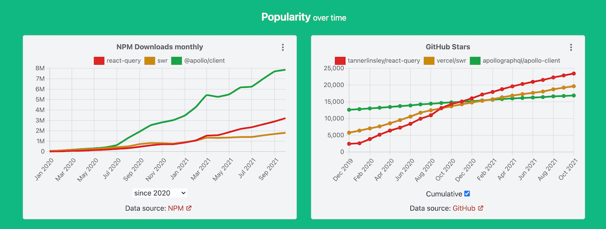

State Management in Frontend is complicated and approaches are not yet settled. New state management libraries keep popping up. In search for a silver bullet, libraries authors come up with different API styles.

Developers continue to struggle. Should they, though? Is the issue a lack of a perfect library?

## The Problem

UI is a function of state. We make a minor modification to application state `setLoading(true)` and the entire UI changes to show the loading indicator.

Doing State Management right is a key ingredient in achieving great UX.

However, it is not a trivial task to do. We need to care about a lot of things:

- define the Store structure and what to put to the Store
- how and when to initialize and update the Store
- immutable vs mutable
- how to handle dependent state data
- how to represent all possible states of API requests
- how to mock Store in tests
- etc.

As a result, we have

- a lot of imperative and boilerplate code
- components tightly coupled with the Store
- components logic that is scattered over multiple files
- complicated tests
- complicated refactoring
- decreased developer productivity

To solve these problems, we developers replace one state management library with another. It may make the code more structured and clean, but it seldom resolves all the issues. Developers continue struggling.

## 💡 Mind shift

Are state management libraries not mature enough to address all our issues?

I don't think we should blame libraries. We must seek the root of the problem in how we use those libraries.

We usually pick one library and use it to handle all of our data. Data with different characteristics and of different nature is treated the same way.

**Separation of Concerns** is what State Management topic has been missing for a long time. _Different types of data deserve different approaches_.

That realization and mind-shift are already happening in the Developer community. We are seeing a rise of libraries designed to manage certain types of data https://moiva.io/?npm=@apollo/client+react-query+relay-runtime+swr.

## UI State vs Server State

The first and foremost data separation should be made between UI State and Server State data because their characteristics differ greatly.

**UI State** includes all the data that is not persistent and is not stored on Server.

It is stored **locally in Browser** and is normally reset on page reload.

The data is **synchronous** (mostly). Changes to data are “immediate” and there is no intermediate state, we don’t need to wait for new data to come. Whenever the state change happens, we always know the new state.

Most UI State changes are triggered by user actions - “click”, “hover”, “scroll”, etc.

Examples of UI State:

- dark/light mode
- filters state
- forms validation state

**Server State** data is stored permanently on Server. UI needs to fetch data from Server and send changes back to Server.

Server State is **Asynchronous**. UI needs to fetch it and that takes time. We don’t know upfront how long it takes and what the value will be. We don’t even know if the request will be successful. The same applies when we need to update the state and persist it on Server.

Another major characteristic of Server Data State - it is **remote** and it is not under our control. It has **shared ownership**. Anyone and anything can change data on the Server without our knowledge. It means, that we don’t know for sure if the fetched data is up to date.

## Solutions for UI State

Most of existing state management libraries (e.g. [Redux](https://redux.js.org/), [MobX](https://mobx.js.org/), [Zustand](https://zustand.surge.sh/)) and approaches are tailored to handle synchronous UI State data:

- define and initialize the Store
- update data in the Store
- subscribe to changes in the Store
- notify all the subscribed components about the State changes.

Developers just need to choose a proper one.

In my experience, the share of UI state and the code needed to manage it is very small for most applications.

That makes the problem of choosing a UI state management library insignificant. If we use those libraries to handle true UI State data only, then most of them work just fine and the switch between any of them does not make a big difference.

## Solutions for Server State

The characteristics of Server State defined [above](./#ui-state-vs-server-state) make the handling of it especially difficult and tricky. And that is where common state management libraries don’t help much.

Some of the challenges that developers face when working with Server State:

- know if data have already been fetched and is available
- know if fetching is currently in progress
- know if fetching has failed
- deduplicate requests
- re-fetch on error
- cache data and invalidate the cache
- handle mutations with dependent data (think of when changing one entity affects other entities)
- optimistic updates
- reflect Server State in UI

We all know the cost of attempting to solve these challenges on our own using common state management libraries.

Fortunately, we are seeing a rise of libraries that specialize in managing Server State and solving all the inherent challenges. These libraries automate the majority of the tasks, drastically reduce the amount of boilerplate code, and provide declarative APIs with thoughtful defaults.

Some of [**GraphQL Clients**](https://moiva.io/?npm=@apollo/client+relay-runtime) were the first who pioneered the approach. They are designed specifically for GraphQL APIs. Example: [Apollo Client](https://www.apollographql.com/docs/react/), [Relay](https://relay.dev/).

Next came libraries to help manage Server State with REST APIs:

- [React Query](https://react-query.tanstack.com/)
- [SWR](https://swr.vercel.app/)
- [RTK Query](https://redux-toolkit.js.org/rtk-query/overview)

At this moment, React Query is probably the most sophisticated and [popular](https://moiva.io/?npm=react-query) library to handle RESTful Server State.

React Query is React specific, but its core was fully [separated](https://react-query.tanstack.com/guides/migrating-to-react-query-3#core-separation) from React and it can be used to build solutions for other frameworks as well. Such solutions have already begun to emerge. For example, [Vue Query](https://github.com/DamianOsipiuk/vue-query/).

## Conclusion

Separation of concerns is crucial for hassle-free state management.

We need to use specialized libraries to manage Server State because it is inherently more complicated and challenging. These libraries drastically reduce the efforts by automating many tasks, providing declarative APIs with thoughtful defaults.

## 🎁 Bonus

Separation of State Data into Server State and UI State solves most of the problems, but we shouldn’t necessarily stop there.

How about separating UI State and extracting data stored in URL? We usually do double work when managing URL state with state management libraries and implementing the necessary synchronization. Why not leave URL state management to our routing libraries?
