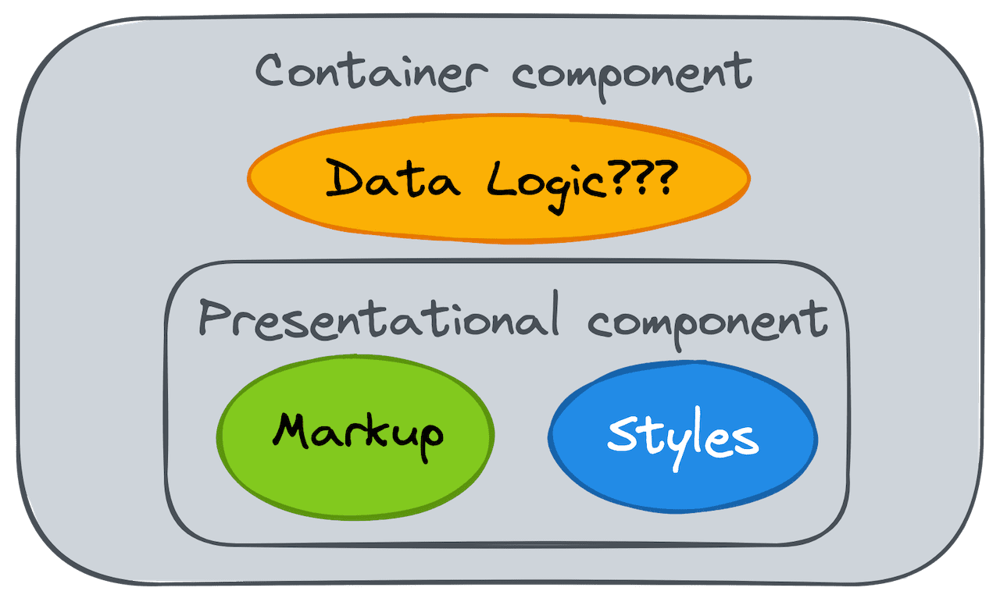

# Widget Driven Development

## Preface

When developing UI applications we compose them from components. Each UI component is essentially a combination of a markup, scoped styles and some logic. In this article I want to show how using recent Frontend developments we can elaborate the concept of Components further and transform them into reusable isolated Widgets.

## The History of Components

Many remember times when all application's styles were defined in one global CSS file. Styles definitions used complex combinations of [CSS selectors](https://developer.mozilla.org/en-US/docs/Web/CSS/CSS_Selectors). As you imagine, applications often suffered from style collisions. Sometimes the size and complexity of those styles even affected the performance of web sites.

In 2009 [BEM](https://en.bem.info/methodology/) was born. BEM provided a set of recommendations how to define styles and how to name classes. Those rules were meant to solve the problem of style collisions and inefficient selectors. BEM encouraged to think of UI in terms of blocks, elements and modifiers.

2013-2015 marked the rise of Components approach. React made it easy to split UI into components which were a combination of a markup (HTML) and logic (JavaScript). It was kinda a revolution in developing applications and reasoning about applications. Other frameworks soon adopted that components based approach as well.

The rise of build tools, CSS preprocessors, and techniques like CSS-in-JS and [CSS Modules](https://github.com/css-modules/css-modules) made it possible to include CSS into Components.

Components playgrounds like Storybook emerged to help developers build components in an isolated environment and ensure proper styles scoping. They encouraged developers to think of UI as [a function of state](https://www.kn8.lt/blog/ui-is-a-function-of-data/): components props values defined the look of components.

Collections of reusable high quality components emerged.

## The unresolved hurdles

Component driven approach helped break UI into isolated reusable pieces and enabled building large-scale applications using collections of pre-built components.

What was missing though is the way of supplying UI components with data.

Data management became one of the most difficult tasks in Frontend Engineering and the main contributor of complexity to UI applications.

We learned to split components into two categories: Presentational and Container components:

- Presentational components are responsible for UI representation and they are usually stateless.
- Container components contain all the data related logic and pass data down to Presentational components.

All that's left is to define logic for Container components to get the required data.

## The Naive approach

The naive approach would be for each Container component to fetch the data needed by underlying Presentational components. The problem is that usually data is shared between multiple components and such approach would then lead to a number of issues, including

- many duplicated requests and data over-fetching and, as a result, slow UI and overloaded server.
- possible UI inconsistency when requests to the same endpoint return different data
- complicated data invalidation (think of a case when the data returned by an endpoint needs to be re-fetched and you need to make sure every component does it)

## The Common parent approach

The solution was to fetch data one time in a common parent Container component and pass data down to all the interested parties. That approach made birth to a new problem called “Prop Drilling” [https://kentcdodds.com/blog/prop-drilling].

## The State Management approach

Two avoid Prop Drilling, we learned to use State Management libraries and techniques: we put data in some Store and then the data from that Store can be easily retrieved by other components. The Store notifies all the subscribed components about the updates.

The usage of state management libraries and techniques itself lead to a number of new problems:

- lots of boilerplate code (think of all those actions, reducers, )
- complicated with indirect data flow logic code which is hard to refactor and optimise
- hard to test
- hard to debug

Such problems are the main reason developers keep reimagining approaches to state management: new state management libraries keep popping up here and there.

## The Naive approach reimagined

Prop drilling and State Management both have the same flaw - the logic of providing data to a specific piece of UI is spread across application and we get tightly coupled container components: via a prop drilling or via a shared store. The components become highly dependant on the their execution context. We can’t easily move components around. Tests require reproduction of the context which is often a non-trivial task.

Can we do better? How about giving the Naive approach another chance? If only we could solve its underlying issues somehow…

Turns out, there are solutions which solve the issues we outlined for the Naive approach. Those solutions fall into two categories based on the type of API:

- different GraphQL clients
- React-Query, SWR, Redux Toolkit Query for RESTful APIs

I find it helpful to think of such libraries as a wrappers for API requests. All we need is to wrap data fetching and mutation requests with those libraries and fetch/mutate data wherever we need. The libraries will make sure all the requests are deduplicated, data are consistent across the application, invalidation happens automatically.

Following the Naive approach, every component is responsible to fetch all the data it needs and also for mutating data. That enables us to get the utterly loosely coupled components which are easy to test. It also removes the burden of worrying about the data propagation and store management. We sort of simply communicating with API: fetching data and mutating data.

## Widget driven development

Here I want to describe the approach to development of UI which enabled my team to build reliable, flexible and easily testable UI with clear logic. I’m extremely happy with the result. It might be beneficial to other developers as well.

The approach is based on the Naive approach and is using React-Query library.

First of all, we started to think of every page of our application as a set of self-contained widgets with little to zero inter-widget communication and dependencies.

Every widget is responsible for:

- fetching and providing all the required data to its UI
- mutating data on server if needed
- data representation in UI
- UI for Loading state
- (optional) UI for Error state

Widgets can include other widgets as well.

Second, we organised our code into widgets:
/ Widget 1

- Container.tsx
- Container.test.tsx
- Presentation.tsx
- Presentation.stories.tsx
- Loading.tsx
  / Widget 2
- …

Most endpoints are reused across multiple widgets. Hence we have a separate folder where we keep all the wrapped queries:
/ queries

- useBook.ts
- useBooks.ts

In our case most widgets’ container components have no props. They rely on routing library to get the required data identifiers from Url and fetch the corresponding data from Backend.

In widgets’ tests we mocked API requests and URL state. Both tasks were straightforward to do. It was easy to test all possible use cases for every widget in isolation.

Every widget can easily be reused on different pages. We just need to make sure the URLs of those pages contain the data identifiers needed for the widget.

The source code for every widget can also easily be moved around.
