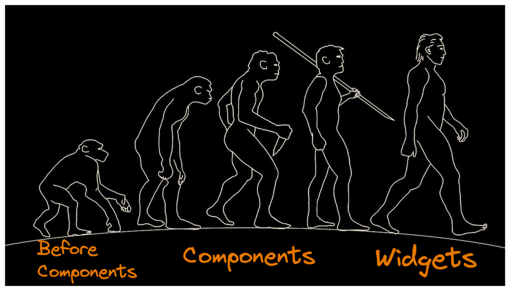
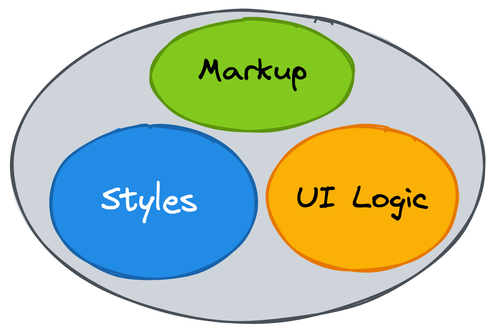
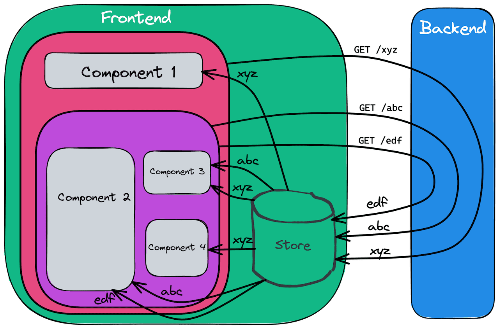

# Widget Driven Development



## Preface

When developing UI applications we compose them from components. Each UI component is essentially a combination of a markup, scoped styles and some logic. In this article I want to show how using recent Frontend developments we can elaborate the concept of Components further and transform them into reusable isolated Widgets.

## The History of Components

Many remember times when all application's styles were defined in one global CSS file. Styles definitions used complex combinations of [CSS selectors](https://developer.mozilla.org/en-US/docs/Web/CSS/CSS_Selectors). As you imagine, applications often suffered from style collisions. Sometimes the size and complexity of those styles even affected the performance of web sites.

In 2009 [BEM](https://en.bem.info/methodology/) was born. BEM provided a set of recommendations how to define styles and how to name classes. Those rules were meant to solve the problem of style collisions and inefficient selectors. BEM encouraged to think of UI in terms of blocks, elements and modifiers.

2013-2015 marked the rise of Components approach. React made it easy to split UI into components which were a combination of a markup (HTML) and UI logic (JavaScript). It was kinda a revolution in developing applications and reasoning about applications. Other frameworks soon adopted that components based approach as well.

The rise of build tools, CSS preprocessors, and techniques like CSS-in-JS and [CSS Modules](https://github.com/css-modules/css-modules) made it possible to include Styling into Components.



Components playgrounds like Storybook emerged to help developers build components in an isolated environment and ensure proper styles scoping. They encouraged developers to think of UI as [a function of state](https://www.kn8.lt/blog/ui-is-a-function-of-data/): components props values defined the look of components.

Collections of reusable high quality components emerged.

## The unresolved hurdles

Component driven approach helped break UI into isolated reusable pieces and enabled building large-scale applications using collections of pre-built components.

What was missing though is the way of supplying UI components with data.

Data management became one of the most difficult tasks in Frontend Engineering and the main contributor of complexity to UI applications.

We learned to split components into two categories: Presentational and Container components:

- Presentational components are responsible for UI representation and they are usually stateless.
- Container components contain all the data related logic and pass data down to Presentational components.

All that's left is to define logic for Container components to get the required data.


## The Naive approach

The naive approach would be for each Container component to simply fetch data needed by underlying Presentational components.


Implementing such approach in practice would bring a bunch of problems because different data is shared between multiple components:

- many duplicated requests and data over-fetching. Slow UI and overloaded server as a result.
- possible data inconsistency between components when requests to the same endpoint return different data
- complicated data invalidation (think of a case when the data returned by an endpoint needs to be re-fetched and you need to make sure every component does it)

## The Common parent approach

We can overcome the problem by putting data-fetching and data-updating logic into a common parent component and passing data down to all underlying components.


We solved the problem with requests duplication and data invalidation. But we got new problems in return:

- the whole application logic became more complex and more coupled
- we have to pass data down through multiple componets. That problem became notorious and got its own name [“Prop Drilling”](https://kentcdodds.com/blog/prop-drilling).

## The State Management approach

Two avoid Prop Drilling problem, we learned to use State Management libraries and techniques: instead of passing data to underlying components we put it in some Store which is directly available to all the components down the tree, so they can easily get the data from there. Components subscribe to the changes in the Store to always have up-to-date data.



The Prop Drilling problem was solved but again we didn't get the solution for free:

- we now have to deal with a completely new concept of the Store and care about a bunch of new things like design and maintain Store structure, properly update data in the Store, mutalbe vs immutable. In addition, many state management libraries come with concepts like Actions, Reducers, Action Creators, Middlewares. Different patterns evolved around store management problems.
- all the new concepts, vocabulary and patterns complicated data management deeper. It became very tangled and coupled. Frustrated developers keep introducing new state management libraries with different syntax in hope of simplifying things.

## The Naive approach reimagined

Can we do better? Is there an easier way to approach data management? Can we have the data flow transparent and easy to understand? Can we untangle our applications and achieve better [orthogonality](https://www.freecodecamp.org/news/orthogonality-in-software-engineering/)?

It seems to me we just went too deep into the forest and _can't see the forest for the trees_. Let's go back to the starting point, to the Naive approach, and see if we can handle its problems differently.

The main bummers there were requests duplication and data inconsistency.

What if we could have an intermediate player between our components and Backend, say an API wrapper or interceptor, solving all those problems under the hood:

- deduplicate all the requests
- ensure data consistency: all the components should always have the same data when using the same request
- provide data invalidation ability: if a component changes data on the server, all the dependendant components should get updated data
- last, but not least, be transparent to the components and not affecting their logic in any way (make components think they communicate to Backend directly)


Turns out we can have it and there are already libraries providing such API Wrappers:

- some GraphQL clients, e.g. [Relay](https://relay.dev/)
- [React-Query](https://react-query.tanstack.com/), [SWR](https://swr.vercel.app/), [Redux Toolkit Query](https://redux-toolkit.js.org/rtk-query/overview), [Vue Query](https://vue-query.vercel.app/) for RESTful APIs

All we basically need to do is to wrap every api call with such an API Wrapper. The rest is handled automatically for us.

The huge benefit of such approach is that we can finally untangle our applications' data logic and achieve better orthogonality by combining all pieces together.


## Widget driven development

In my team we started to use the Naive approach described above and we love it a lot. It enabled us to approach building our application differently. Let me call it _"Widget Driven Development"_.

The idea is that we split every page into so-called _widgets_, which are utterly independendant and self-contained.


Every widget is responsible for:

- fetching and providing all the required data to its UI
- mutating the related data on server if needed
- data representation in the UI
- UI for Loading state
- (optional) UI for Error state

Speaking of code organisation, we co-locate all the widgets related files:


Usually the same API endpoint is used across multiple widgets. So we decided to keep all of them in a separate shared folder.


:::info note
Such queries organisation works well for us because we use RESTful APIs and React Query. In case of GraphQL APIs it might not make sense.
:::

We use React Query library and each file in the `queries/` folder exposes fetch and mutation methods wrapped into React Query.

All Container components have a similar code structure.

```ts
import { useParams } from 'react-router-dom';
import { useBookQuery } from 'queries/useBookQuery';
import { useAuthorQuery } from 'queries/useAuthorQuery';
import Presentation from './Presentation';
import Loading from './Loading';
import Error from './Error';

export default BookDetailsContainer() {
  const { bookId } = useParams();
  const { data: book, isError: isBookError } = useBookQuery(bookId);
  const { data: author, isError: isAuthorError } = useAuthorQuery(book?.author);

  if (book && author) {
    return <Presentation book={book} author={author} />
  }

  if (isBookError || isAuthorError) {
    return <Error />
  }

  return <Loading />
}
```

Notice how easily and declaratively dependant queries are handled. Also the only dependency of our widget is the presence of `bookId` in the url.

Most our widgets’ container components have no props and rely on no external state except for URL data.

Such approach makes it transparent what API queries our widget relies upon. That transparency combined with near to zero external dependencies makes it easy to test widgets and gives us confidence in our code.

Any changes to a widget are, usually, limited by that widget's folder. It significantly limits the risk of breaking any other parts of the application.

Introduction of new widgets is also very straightforward: create a new folder for the widget with all required files in it and, if necessary, create a new query in the `/queries` folder. Again, the risk of breaking any other parts of the application if very limited.

Every widget can also be easily reused on different pages thanks to the limited dependency on the context. We usually just need to make sure the URLs of those pages contain the data identifiers needed for the widget.

## Conclusion

The components approach made it easy and straightforwad creating reusable independant pieces of UI.

Nevertheless, frontend applications are often suffer from the same symptoms: high level of inter-dependency between different parts of application, complicated tests, complicated changes, reduced development velocity. The root cause is usually a poor data management.

There are libraries which enable approach data management differently and significanly reduce complexity of our applications making them more robust and easy to test. Developers can get more confidence and be more productive.
