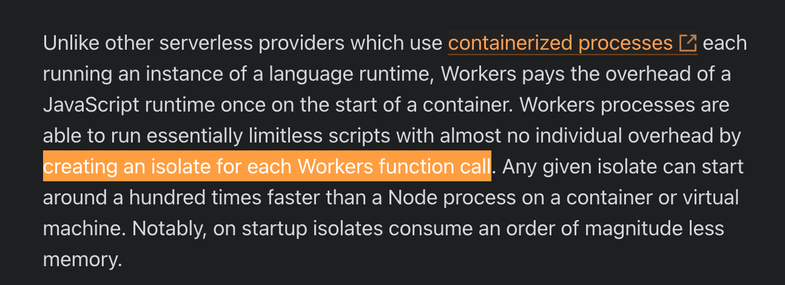

I’ve fundamentally misunderstood how Cloudflare Workers work.

While setting up Sentry for my [Notion<=>Google Tasks](https://notion-google-tasks-sync.com/) integration app, I noticed that a single Issue in Sentry contained data (”breadcrumbs”) from different requests to the Cloudflare Worker. This was a startling discovery indicating a data leak between Workers requests.

That implied either of two things:

- Cloudflare has a bug in their “beta” [Queues Workers](https://developers.cloudflare.com/queues/) product
- My fundamental knowledge and assumptions about Cloudflare Workers have been wrong for years since their introduction.

After a brief conversation in their Discord channel and with the Director of Product for Cloudflare Workers, I learnt that my understanding had been wrong.

I had believed that every Worker invocation is executed in a completely isolated environment, with a new V8 isolate created for each call and discarded right after the call is finished. This assumption led me to think that there was no need to worry about possible data leaks between calls, a problem inherent in most (all?) serverless platforms. This feature was one of the primary reasons I was excited about Workers.

However, the reality is that Workers isolates are actually shared between calls, which explains why a single exception in Sentry contained data from multiple calls.

Where did I get such misunderstanding from?

Part of the blame lies with Cloudflare’s [How Workers works](https://developers.cloudflare.com/workers/reference/how-workers-works/) page, which, up to this day, has contained a wrong statement:

> “Workers processes are able to run essentially limitless scripts with almost no individual overhead by creating an isolate for each Workers function call”.

I have created an [issue](https://github.com/cloudflare/cloudflare-docs/issues/12885) in their docs repository to address that misleading statement.

The other part of the blame is on me for not thoroughly reading that page from top to bottom, failing to spot the contradiction and not validating my assumptions.

That revelation makes me to rethink my approach to building Workers apps.
