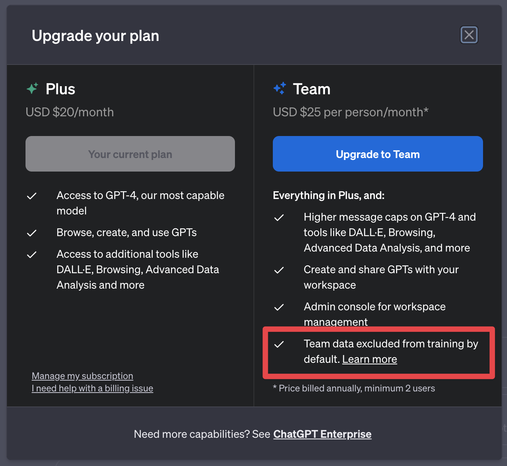
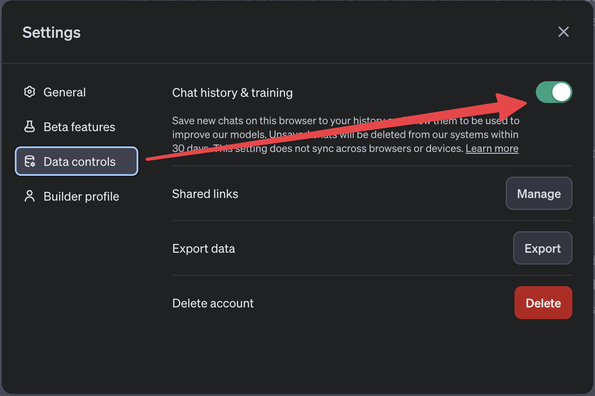
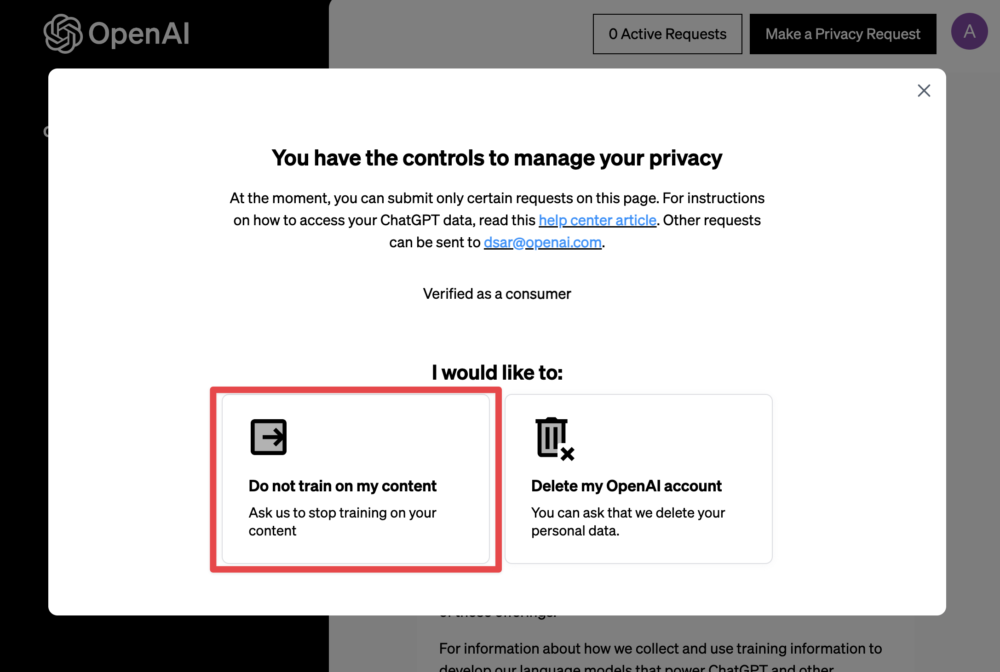

Last week OpenAI [released](https://openai.com/blog/introducing-chatgpt-team) a new ChatGPT plan - Teams plan. The new plan has one specific feature:

- No training on your data

It struck me because I had previously assumed that Plus users’ data was not used for training by Open AI. Apparently, I was wrong.

I use ChatGPT heavily not just for work, but also for personal matters. I don’t feel comfortable knowing that it uses my data for some training and, potentially, shares it with the world.

**The data I share with ChatGPT should be private.**

I don’t want to use the more expensive Teams plan just for its privacy feature. I wondered if there is any other way of opting out of training?

I dug in and found two ways.

**The first approach** is using a setting in ChatGPT Data Controls. This is the solution that OpenAI promotes and recommends:

- go to “Settings & Beta” ⇒ “Data Controls” ⇒ “Chat History & training” and turn the setting off.

This approach has one significant drawback - it’s coupled with the “Chat History” feature meaning that you can’t turn the training off and keep Chat History. You either have both or don’t. Even more so, this setting is not synced across devices: if you turn it off in your Browser, it won’t apply to you mobile app. More about that setting [here](https://help.openai.com/en/articles/7730893-data-controls-faq).

Everything suggests that OpenAI intentionally designed this opt-out feature in a way that users won't use it, and even if they do use it, then it will work only partially.

**The second approach**, the real 💪 approach, is not easy to find. It's mentioned only briefly in OpenAI FAQ. What you need is

• go to [privacy.openai.com/policies](http://privacy.openai.com/policies) page and submit a “Privacy Request” there.

After submission you’ll soon be notified that your data is no longer used for training. This is exactly what we need: the ability to opt of Training across all devices, while still retaining all of ChatGPT's features.
