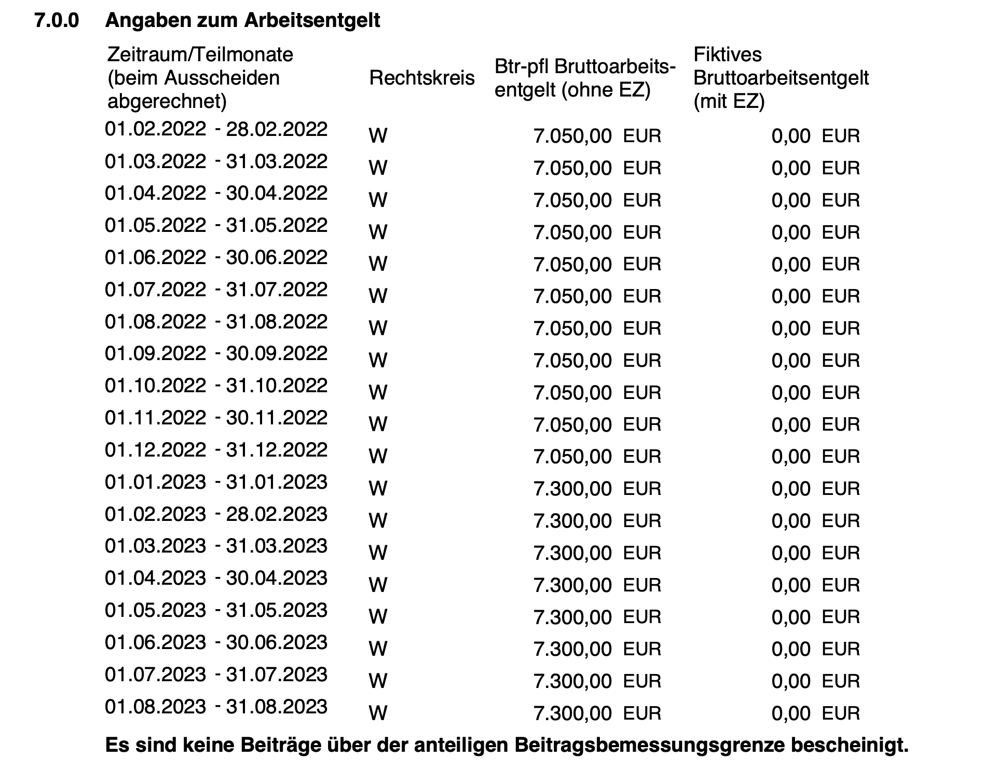

Two days ago, I received a document from the German Agentur für Arbeit approving my claim for unemployment benefits.

I would like to shed some light on the procedure I followed and detail the amount of the benefits I received. In light of the mass layoffs sweeping across the tech industry, I believe this kind of information could be of interest to others.

## The Chronology

Here is a chronology of the events:

- Flink, my employer at the time, announced a layoff, and I received a termination agreement.
- **25.05.2023** - I created an account on the Agentur für Arbeit's website, [arbeitsagentur.de](https://www.arbeitsagentur.de/).
- **26.05.2023** - I registered as a job seeker online at arbeitsagentur.de. It's advised to do this as soon as possible.
- **09.06.2023** - I had an interview at the Agentur für Arbeit office. This meeting was just a formality, where I detailed my skills and was registered on their job portal.
- **16.08.2023** - I registered as unemployed online at arbeitsagentur.de. This step should be taken at least two weeks before becoming officially unemployed. Since I remained employed until 31.08, I completed this step on the given date.
- **05.09.2023** - I submitted employment certificates from all my previous employers, as required by the agency. This meant reaching out to Zalando and Flink to obtain these documents.
- **15.09.2023** - I received the _Bewilligungsbescheid_, a document that approved my claim for benefits, detailing the calculations and specifications of the benefits.

As you might notice, two critical and distinct steps are registering as a job seeker and registering as unemployed. The first step should be taken immediately after receiving notice from your employer, while the second step should be undertaken two weeks before your employment ends.

Now, let's dive into the specifics of the financial assistance one might expect to receive in Germany and whether it suffices to cover living expenses and the duration one can expect to receive it.

## The Benefits (in theory)

During my research on potential benefits, I found that the expected allowance depends on whether you have children: 67% of the average salary from the previous year for those with children, and 60% for those without. One can expect to receive these benefits for up to 12 months.

The 67% figure seemed sufficient to cover the basic needs of my family, and we could potentially sustain ourselves on it. Additionally, I had a safety net in the form of savings and fortunately no debts to service, having learned the importance of avoiding debts long ago.

## The Benefits (in practice)

However, the reality turned out slightly different. My employment certificate from Flink listed a gross salary of 7050 EUR up until 2023, which then increased to 7300 EUR. This was significantly less than my actual salary.

I learned about the existence of the "Beitragsbemessungsgrenze", which translates to "contribution assessment ceiling." This term refers to the maximum income amount subject to social security contributions, including payments towards health insurance, pension insurance, unemployment insurance, and long-term care insurance. Income exceeding this ceiling isn't subject to social security contributions, and the ceiling value varies for each type of contribution. In 2022, the monthly Beitragsbemessungsgrenze for unemployment insurance was 7050 EUR, increasing to 7300 EUR in 2023.

As my salary surpassed these values, the Employment Agency used these threshold values instead of my actual salary to calculate the benefits. After deducting social contributions and taxes, 67% of the remaining amount was designated as my unemployment benefit.

**As a result, the actual value of the benefits amounted to roughly 50% of my net salary (after taxes and social contributions). Unfortunately, this amount doesn't cover my family's basic expenses, forcing me to dip further into my savings.**
