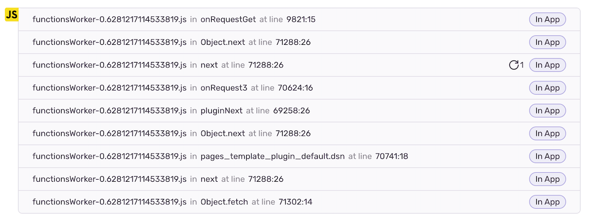
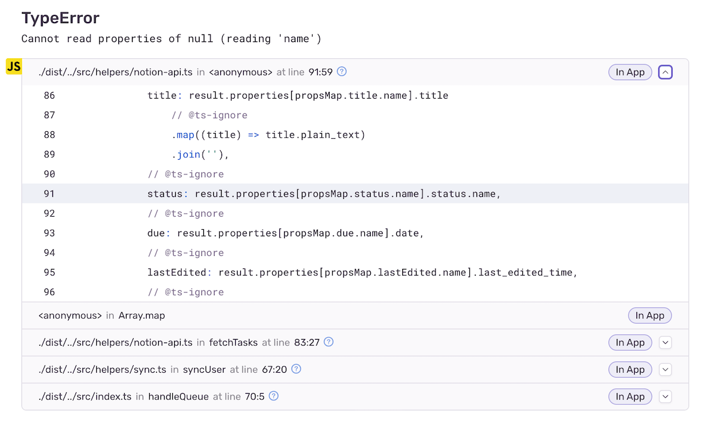
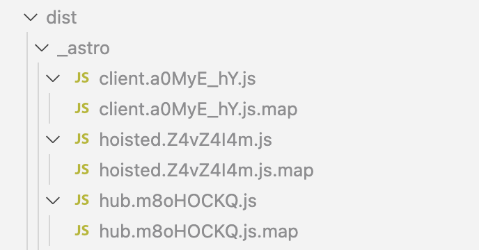
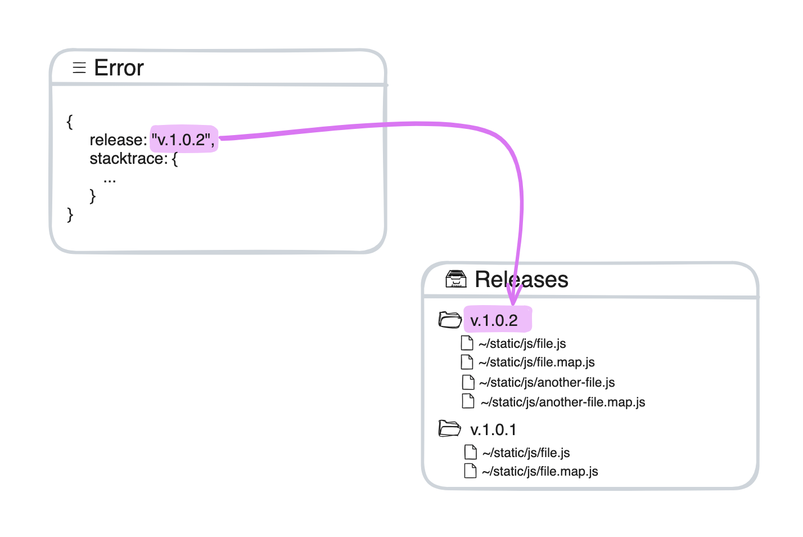
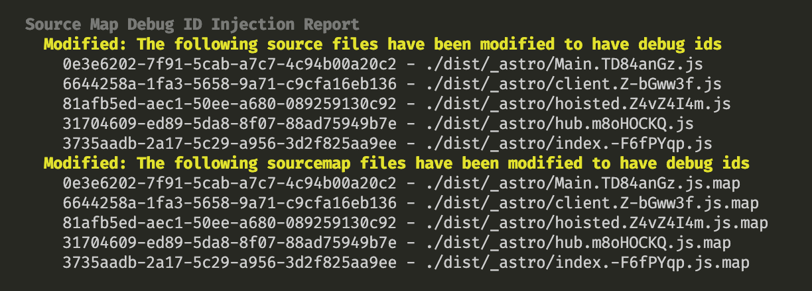

import { Image } from "astro:assets";
import sentryLookupImg from "./sentry-lookup.png";

**TLDR**: Sentry has come up with a simple and reliable way to associate production code with source maps and set it working. No excuses for not using source maps anymore.

Around this time a year ago I was busy finding my way around a proper observability setup for Flink’s (my employer at that time) microfrontends. The main hurdle was dealing with source maps in [Datadog](https://www.datadoghq.com/) (an observability tool) which hadn’t supported microfrontends natively and I was looking for a workaround.

---

### Why source maps?

Code errors reported to an observability service (e.g. Sentry, Datadog) contain stack traces with a chain of functions calls which lead to the exception. This information includes function name, file name and place in the file where the function is called. That should help developers in debugging their code - locate the problematic code faster.

The problem though is that our code in production is obfuscated and minified. This means that function names, filenames and function calls locations from stack traces are of no use to us.



To solve that problem observability services use source maps - kind of a mapping between obfuscated production code and raw code. Production errors’ stack traces get translated into true function names and their calls locations in the original raw code. Observability tools even restore the raw code in the vicinity of each function call. As a result, pinpointing the problematic code becomes much easier.



### Where to get source maps?

Source maps are files with `.js.map` extension. They are generated by code bundlers e.g. Webpack, Vite. For each `[filename].js` file an accompanying `[filename].js.map` file is generated.



When deploying your code to production, you need to upload the associated source maps to your observability service.

### The problem with source maps

When dealing with source maps, the hurdle lies in association of minified `[filename].js` files with their `[filename].js.map` source maps. Depending on your setup, filenames may persist but their contents change with every deploy. Your observability service end up having multiple source maps for a single filename. Which one should it use to deobfuscate an error stacktrace at hand?

To overcome this issue, most observability tools rely on extra information: _releases_ (versions). It requires you to perform two extra steps:

- for each production deploy, you should generate a new release number and provide that number when uploading source maps to your observability tool. One release number for all the files per deploy.
- In runtime, when initialising observability service, you tell what release number to use. That information will accompany all reported runtime errors.

Observability services take the release number from the reported errors and use it to look up for the appropriate source map file associated with it.



That approach is not a silver bullet though and is not 100% reliable because applications in production might use code from different releases. Imagine a long lived large SPA applications with code splitting: a user loads one page with a set of scripts in the morning and another page with another set of scripts in the evening. Two sets of scripts might belong to two different releases, but the running application keeps the same release number since the initialisation time. That means that errors for later loaded scripts might have wrongly associated source maps.

Beside that problem with reliability, such approach also doesn’t fit the use case of microfrontends. Each team deploys their microfrontend independently and has their our own releases. What release should the final application use when initialised? One can come up with workarounds (that is what I was doing), but that will just add more to the overall complexity around the source maps handling and make the reliability problem even worse.

### Debug IDs to the Rescue!

[Sentry](https://sentry.io/) has come up with a really neat and elegant solution to the above problems.
Instead of generating releases and assigning them when uploading source-maps and initialising the application, one simply includes an additional post-bundling step - running the command

```bash
sentry-cli sourcemaps inject ./dist
```

which will generate a unique `debug-id` identifier to each script in the output `./dist` folder and include it in the script files as well as into the accompanying source map files. And then proceed with normal deployment and source maps upload.



With that, every stack frame will include `debug-id` in addition to function name, filename, and location. It will be used to associate a particular stack frame (i.e. function call) with a particular source map. That solves the reliability problems: all the files self-contain the necessary for the association information. No need for dances around releases.

<figure style={{ textAlign: "center" }} className="text-sm text-gray-300">
  <Image
    src={sentryLookupImg}
    alt="a drawing showing how Sentry associates error stack frames with source map files"
  />
  <figcaption>Source: sentry.io</figcaption>
</figure>

If you’re using Sentry and have either used the releases approach or haven’t set up the source maps yet, I encourage checking out the new approach. It has never been easier to use source maps with observability tools.

Not all tools support that `debug-id` approach yet. I checked Datadog docs and they still suggest using releases.

Hopefully situation will change soon and all other observability services adopt similar approach.
