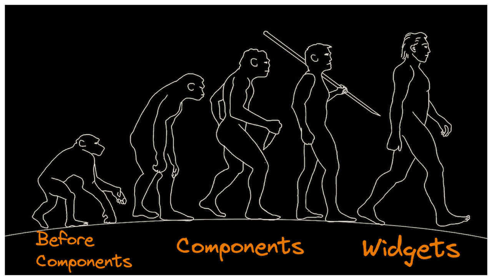
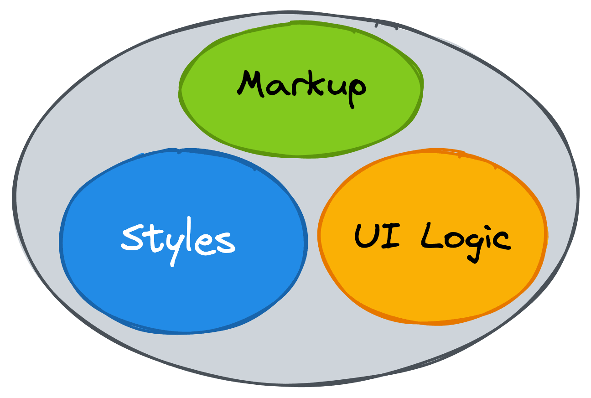
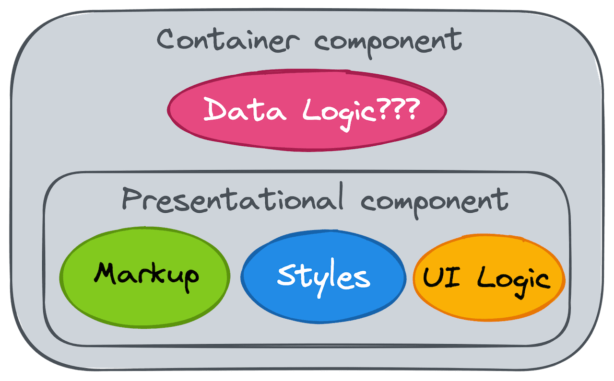
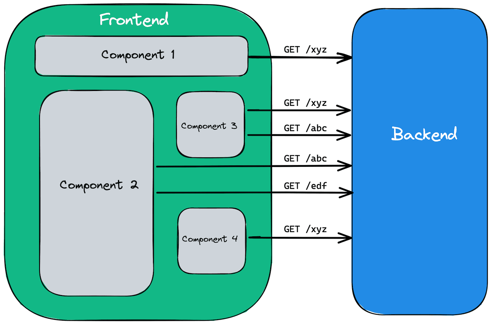
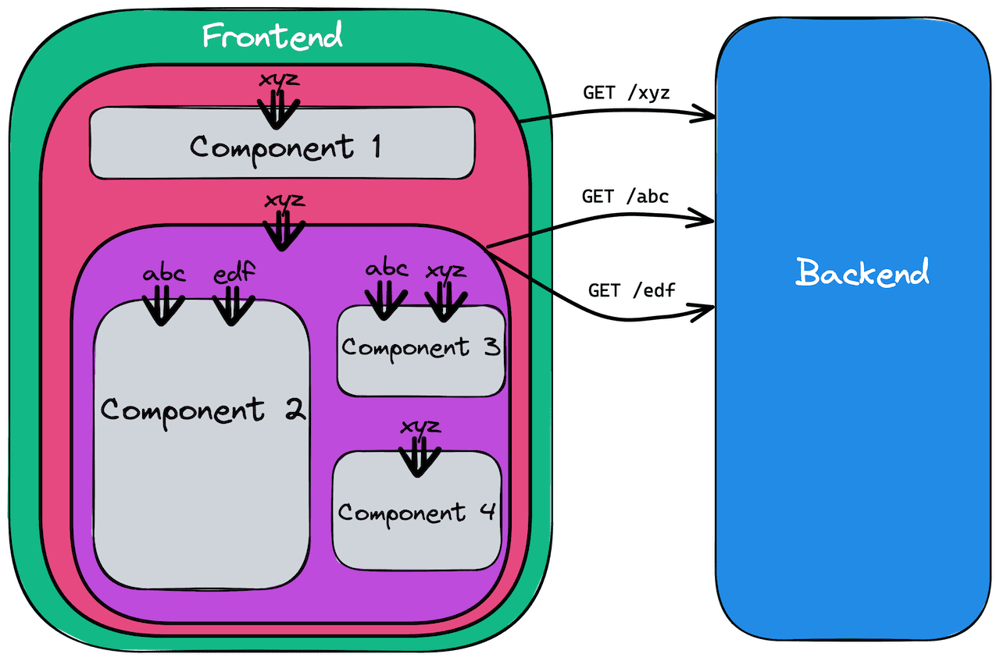
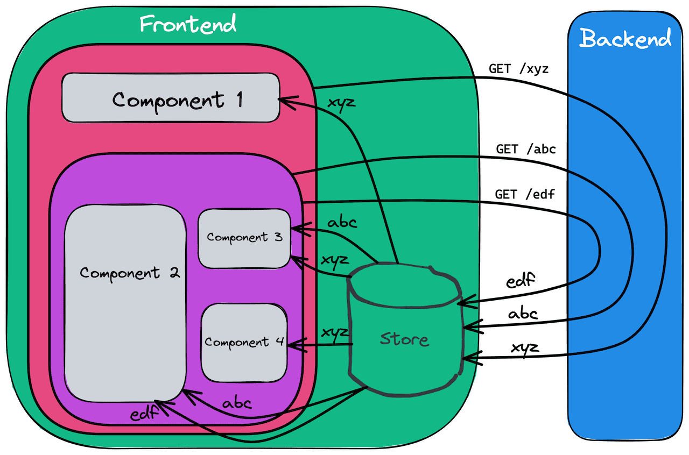
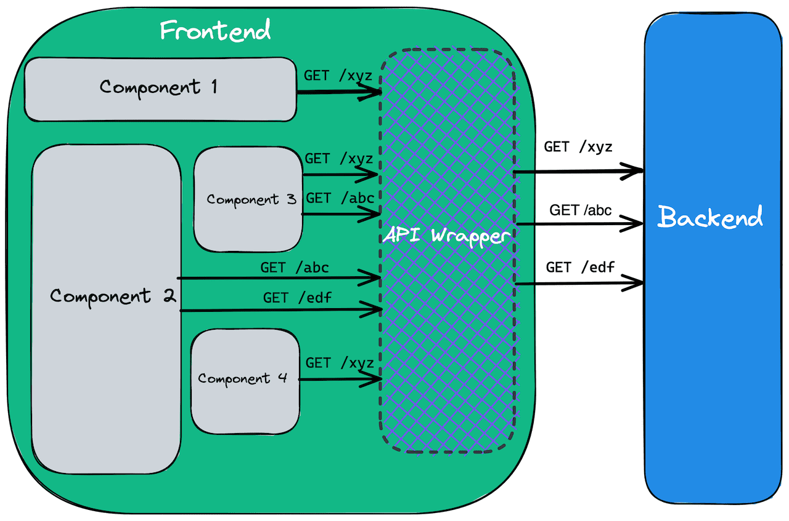
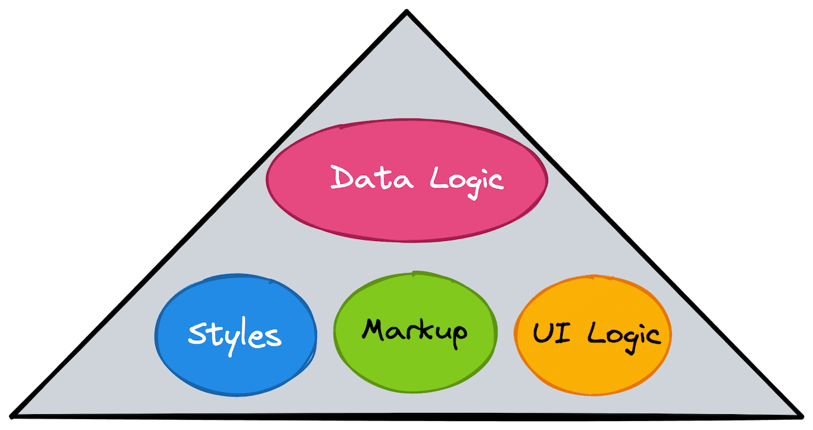

## Preface

When developing UI applications, we compose them from components. Each UI component is essentially a combination of markup, scoped styles, and some UI logic. Data Management is frequently left out of components control, resulting in a complicated architecture with convoluted data flows.

In this article, I'll demonstrate how we can transform components into autonomous isolated widgets with complete control over both Data Logic and UI.

## The History of Components

Widgets, in my opinion, are the natural successors of Components. To see this, I suggest going back in time and look at how our approaches to building UI have evolved over time.

Many remember the times when all application styles were defined in a single global CSS file. Styles definitions used complex combinations of different [CSS selectors](https://developer.mozilla.org/en-US/docs/Web/CSS/CSS_Selectors). Style collisions were common in apps. The size and complexity of those styles sometimes affected even the performance of websites.

In 2009 [BEM](https://en.bem.info/methodology/) was born. BEM provided a set of guidelines for defining styles and naming classes. These rules were intended to address the problem of style collisions and inefficient selectors. BEM encouraged to think of UI in terms of blocks, elements, and modifiers.

2013-2015 marked the rise of **Components** approach. React made it simple to divide UI into components that were a combination of markup (HTML) and UI logic (JavaScript). It was a game changer in application development. Other frameworks soon followed suit, adopting a components-based approach as well.

With the rise of build tools, CSS preprocessors, and techniques like CSS-in-JS and [CSS Modules](https://github.com/css-modules/css-modules), it became feasible to make Styling a part of Components.



Components playgrounds such as Storybook emerged to help developers build components in an isolated environment and ensure proper styles scoping. They encouraged developers to think of UI as [a function of state](https://www.kn8.lt/blog/ui-is-a-function-of-data/): components props values defined the look and behaviour of components.

Collections of reusable high-quality components became a thing.

## The unresolved hurdles

Component-driven approach helped break UI into isolated reusable pieces and enabled building large-scale applications using collections of pre-built components.

What was missing, though, is a way of supplying UI components with data.

Data management became one of the most difficult tasks in Frontend Engineering and the primary contributor to the complexity of UI apps.

We learned to split components into two types:

- _Presentational_ components, which are responsible for UI representation and are usually stateless and side-effect free
- _Container_ components, which deal with data-related logic and pass data down to Presentational components.

All that remains is to define how Container components should work with data.



## The Naive approach

The naive approach would be for each Container component to simply fetch data needed by underlying Presentational components.



Because the same data is usually needed by multiple different components, implementing such an approach in practice would bring a bunch of problems:

- duplicated requests and data over-fetching. Slow UI and overloaded server as a result.
- possible data inconsistency between components when requests to the same endpoint result in different data
- complicated data invalidation (think of a case when the data has changed on Backend and you need to make sure every dependent component refetches the data)

## The Common parent approach

We learnt to overcome the problem by moving data-fetching (and mutation) functionality up to common parent components which pass data down to all underlying components.



We solved the problem of requests duplication and data invalidation. However, we did face new challenges:

- the whole application logic became more complex and more coupled
- we were forced to pass data down through multiple components. This issue became notorious and got a name [“Prop Drilling”](https://kentcdodds.com/blog/prop-drilling).

## The State Management approach

To bypass the Prop Drilling problem, we learnt to use State Management libraries and techniques: instead of propagating data down to underlying components, we place data in some Store that is accessible to all the components down the tree, letting them obtain the data directly from there. Components subscribe to the changes in the Store to have the data always up-to-date.



The Prop Drilling issue was resolved, but not for free:

- we now have to deal with a completely new concept, the Store, and care about a bunch of new things, such as designing and maintaining Store structure, appropriately updating data in the Store, data normalization, mutable vs immutable, a single store vs multiple stores, and so on.
- state management libraries require us to learn a new vocabulary: _Actions_, _Action Creators_, _Reducers_, _Middlewares_, _Thunks_, and so on.
- the introduced complexity and lack of clarity forced developers to create [styleguides](https://redux.js.org/style-guide/style-guide) on how to work with the Store, what to do and what to avoid.
- as a result, our applications became very tangled and coupled. Frustrated developers try to mitigate the issues by inventing new state management libraries with different syntax.

## The Naive approach reimagined

Can we do better? Is there an easier way to approach data management? Can we have the data flows transparent and easy to understand? Can we untangle our apps and boost [orthogonality](https://www.freecodecamp.org/news/orthogonality-in-software-engineering/)? Can we bring Data Logic under control of Components in the same way that we have done with Markup, Styles and UI Logic?

We must have gotten too far into the woods and _can't see the forest for the trees_. Let's go back to the starting point, to the Naive approach, and see if we can solve its problems differently.

The main bummers there were requests duplication and data inconsistency.

What if we could have an intermediate player between our components and Backend, say an API wrapper or interceptor, solving all those problems under the hood:

- deduplicate all the requests
- ensure data consistency: all the components should always have the same data when using the same request
- provide data invalidation ability: if a component changes data on the server, other components that rely on that data should receive the new data
- be transparent to components and not affect their logic in any way (make components think they communicate to Backend directly)



The good news is that we can have it, and there are already libraries providing such solutions:

- some GraphQL clients, e.g. [Relay](https://relay.dev/)
- [React-Query](https://react-query.tanstack.com/), [SWR](https://swr.vercel.app/), [Redux Toolkit Query](https://redux-toolkit.js.org/rtk-query/overview), [Vue Query](https://vue-query.vercel.app/) for RESTful APIs

All we basically need to do is to wrap every API call with such an API Wrapper. The rest is handled automatically for us.

The huge benefit of such an approach is that we can finally untangle our applications' data logic, put Data Logic under control of Components, and achieve better orthogonality by combining all pieces together.



## Widget driven development

In my team, we started to use the described above Naive approach together with React Query and we love it. It enabled us to approach building our application differently. Let me call it _"Widget Driven Development"_.

The idea is that we split every page into so-called _widgets_, which behave autonomously and are self-contained.


Every widget is responsible for:

- fetching and providing all the required data to its UI
- mutating the related data on server if needed
- data representation in the UI
- UI for Loading state
- (optional) UI for Error state

Speaking of code organization, we co-locate all the widgets related files:


Usually, the same API endpoint is used across multiple widgets. So we decided to keep all of them in a separate shared folder.


:::info note
Such queries organization works well for us because we use RESTful APIs and React Query. It might not make sense in the case of GraphQL APIs.
:::

We use React Query library and each file in the `queries/` folder exposes fetch and mutation methods wrapped into React Query.

All Container components have a similar code structure.

```ts
import { useParams } from 'react-router-dom';
import { useBookQuery } from 'queries/useBookQuery';
import { useAuthorQuery } from 'queries/useAuthorQuery';
import Presentation from './Presentation';
import Loading from './Loading';
import Error from './Error';

export default BookDetailsContainer() {
  const { bookId } = useParams();
  const { data: book, isError: isBookError } = useBookQuery(bookId);
  const { data: author, isError: isAuthorError } = useAuthorQuery(book?.author);

  if (book && author) {
    return <Presentation book={book} author={author} />
  }

  if (isBookError || isAuthorError) {
    return <Error />
  }

  return <Loading />
}
```

Notice how easy and declaratively dependant queries are handled. Also the only dependency of our widget is the presence of `bookId` in the URL.

Most of our widgets’ container components have no props and rely on no external state except for URL data.

Such an approach makes it transparent what API queries our widget relies upon. That transparency combined with near to zero external dependencies makes it easy to test widgets and gives us confidence in our code.

Usually, changes to a widget are limited by modifications to files under that widget's folder. It significantly limits the risk of breaking any other parts of the application.

Adding new widgets is also very straightforward: create a new folder for the widget with all required files in it and, if necessary, create a new query in the `/queries` folder. Again, the risk of breaking any other parts of the application is very limited.

Every widget can also be easily reused on different pages thanks to the limited dependency on the context. We usually just need to make sure the URLs of those pages contain the data identifiers needed for the widget.

## Conclusion

The Components approach made easy and straightforward creation of reusable independent pieces of UI.
It didn't solve all the problems though and Frontend applications often suffer from convoluted Data Management.

There are libraries that enable approaching Data Management differently and significantly reduce the complexity of our applications.

Leveraging those libraries, we can put data logic under control of components and convert an application into a set of reusable self-contained widgets. It makes the data flows transparent, architecture flexible, the code resilient and easy to test.
